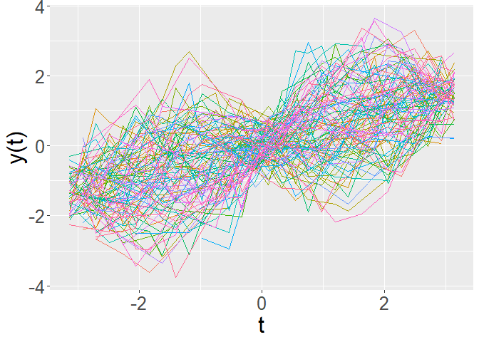
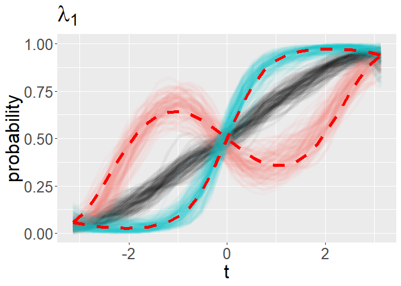
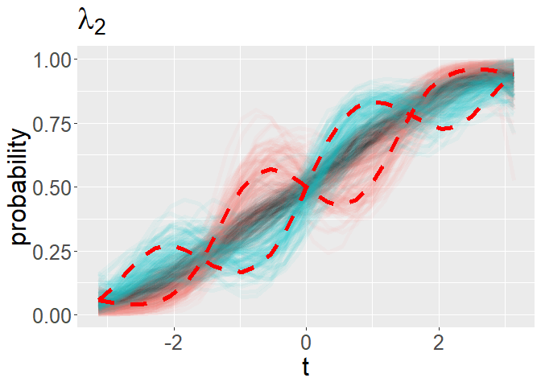
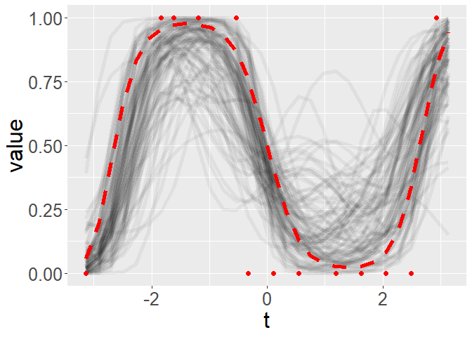

# FFA with NeMO Processes Demonstration

# Introduction 

This document demonstrates the methods described in the following paper: J. Matuk, A.H. Herring, D.B. Dunson (2022+) 'Bayesian modeling of nearly mutually orthogonal processes'. The authors define nearly mutually orthogonal (NeMO) processes, which are used to enforce near mutual orthogonality for a set of random functions. As demonstrated in the paper, NeMO processes are useful as a prior model for factor loadings in functional factor analysis (FFA) and generalizations to non-Gaussian data. See the paper for an in depth discussion for the motivation and methods. This GitHub repository has code that implements the methods described in the paper. 

The directory  `paper_replication` has code that replicates the results presented in the paper. View the `README.txt` file for the workflow to replicate the paper results. 

The remainder of this document is dedicated to implementing simple examples on simulated data to help practitioners implement the methods for applications of interest. The following packages need to be loaded into the current `R` session: `Rcpp`, `tidyverse`, `reshape2`, `GGally`, `rootSolve`. The `src` directory contains `R` and `c++` functions that will be used throughout this demonstration, and should be included in the current `R` working directory. The functions used for FFA using NeMO processes can be sourced as follows. 


```r
sourceCpp("./src/nemo_ffa.cpp")
sourceCpp("./src/msf.cpp")
source("./src/nemo_ffa.R")
```

The first example illustrates Bayesian FFA using NeMO processes. The second example illustrates Bayesian generalized FFA (GFFA) using NeMO processes for binary functional data. We assume the reader is familiar with the 'Bayesian modeling of nearly mutually orthogonal processes' paper from which we borrow notation. 

# FFA using NeMO processes 

The follow code chunk generates noiseless random functions according the observation model in the paper (Equation (6)). That is, $f_i(t) = \mu(t) + \sum_{k = 1}^2\eta_{k,i}\lambda_k(t)$, where $\mu$ denotes the mean process, $\lambda_1,\lambda_2$ are orthogonal functions that represent functional factor loadings, and $\eta_{1,i}\eta_{2,i}$ are latent factors, $i = 1,\ldots,100$. The latent factors are standard normal random variables that have been projected to sum to zero, so that the factor loadings  are not confounded with the mean process. The mean process and loadings are evaluated on the same common time grid, `time_grid`.


```r
# set seed for reproducibility
set.seed(1234) 
# common observation grid of length M
M <- 30
time_grid <- seq(-pi,pi,length.out = M) 
# linear mean process with slope .5 and intercept 0
mu_true <- .5*time_grid
# loadings are orthogonal functions 
lambda_true <- cbind(sin(time_grid),.5*sin(2*time_grid))
# true number of factors
K_true  <- dim(lambda_true)[2]
# number of simulated observations
N <- 100
# latent factors
eta_true <- rnorm(K_true*N) %>% matrix(nrow = K_true)
eta_true <- eta_true - apply(eta_true,1,mean)%*%t(rep(1,N)) # ensure that they sum to zero
# underlying noiseless functions
f <- mu_true%*%t(rep(1,N)) + lambda_true%*%eta_true
```

We generate and visualize the observations $y_i$ that we will use to inform our model. These are sparse and noisy version of the underlying functions $f_i$.  


```r
#generate  subject specific observation grids
sparsity_level <- .5
obs_grid <- sample(c(0,1),M*N,replace = T, prob = c(sparsity_level,1-sparsity_level)) %>%
            matrix(nrow = M) 
# noise
noise_level <- .5
noise <- rnorm(M*N,sd = noise_level) %>% matrix(nrow = M)
# sparse and noisy observations
y <- f + noise
y_common <- y*obs_grid
plot_data(time_grid,y_common,obs_grid)
```

<!-- -->

Notice that `y_common` is an $M\times N$ matrix, `obs_grid` is an $M\times N$ binary matrix, and `time_grid` is an $M$ vector.

The Markov chain Monte Carlo (MCMC) algorithm presented in Appendix D of the paper (Algorithm 1) for FFA using NeMO processes is implemented in the function `nemo_ffa_mcmc`. Inputs include the observations, `y_common`, subject-specific grids, `obs_grid`, and  common grid `time_grid`. `K` is the assumed number of latent factors. Prior hyperparameters for length-scale and scale parameters of the covariance functions of parent GPs are specified using variables `prior_a`, `prior_b` and `prior_var`. The function `length_scale_hyper` is designed to specify appropriate hyperparameters for the length-scale parameter based on `time_grid`. The total number of MCMC iterations is specified as `n_iter`, and the number of of MCMC samples to save is specified based on `lag`. In total `n_iter/lag` MCMC iterations are saved.  Under these settings, the MCMC wrapper function,`nemo_ffa_mcmc`, took around 1 minute to run on a standard laptop. 


```r
# specify parameters for MCMC
K <- 3
nu_eta <- 1e-4
nu_lambda <- 1e-4

inv_g_hyper <- length_scale_hyper(time_grid)
prior_a <- inv_g_hyper[1]
prior_b <- inv_g_hyper[2]
prior_var <- 1
n_iter <- 10000
lag <- 10
# run MCMC algorithm
mcmc_output <- nemo_ffa_mcmc(y_common,obs_grid,time_grid,
                           K,nu_eta,nu_lambda,
                           prior_a,prior_b,prior_var,
                           n_iter,lag)
```

The `mcmc_output` variable is a list that contains MCMC samples for all parameters in the hierarchical models presented in Appendix D of the paper. The parameters $\lambda_1,\ldots,\lambda_3$ and $\eta_{1,i},\ldots,\eta_{3,i}$ are not identifiable due to label switching and sign ambiguities. These identifiability issues can be resolved using [E. Poworoznek, F. Ferrari, D.B. Dunson (2021) 'Efficiently resolving rotational ambiguity in Bayesian matrix sampling with matching'](https://arxiv.org/abs/2107.13783,) (Algorithm 1, steps 2-3). This ambiguity is resolved based on functions forked from the `infinitefactor` `R` package. MCMC samples with ambiguity resolved are stored in `mcmc_processed`. In this illustration, the number of latent factors is chosen to be $K = 3$, however, this can be automatically chosen by the model through the `init_ffa_mcmc' function. The method for choosing the dimension of the latent space is outlined in Section 3.4 of our paper. 


```r
mcmc_processed <- organize_mcmc(mcmc_output,time_grid,n_iter/lag)
```

Inference is based on these processed posterior samples. The following code chunk visualizes the inferred mean process, $\mu$. The mean process used to generate the data in the following figure is shown using the dashed, red line and the MCMC samples are shown using transparent gray lines. 


```r
p <- plot_fun_parameter(mcmc_output$mu_save,time_grid,y_label = expression(mu(t)))
p + geom_line(aes(x = time_grid,y = mu_true),color = 'red',size = 2,linetype = 2)
```

<!-- -->

The following code chunk visualizes the inferred functional factor loadings, $\lambda_1,\ldots,\lambda_3$. The laodings used to generate the data in the following figure is shown using the dashed, red line and the MCMC samples are shown using transparent gray lines. 


```r
yl <- c(min(mcmc_processed$lambda_save),max(mcmc_processed$lambda_save))
p <- plot_fun_parameter(mcmc_processed$lambda_save[,1,],time_grid,y_label = expression(lambda[1](t)),yl = yl)
p + geom_line(aes(x = time_grid,y = lambda_true[,1]),color = 'red',size = 2,linetype = 2)
```

<!-- -->

```r
p <- plot_fun_parameter(mcmc_processed$lambda_save[,2,],time_grid,y_label = expression(lambda[2](t)),yl = yl)
p + geom_line(aes(x = time_grid,y = -lambda_true[,2]),color = 'red',size = 2,linetype = 2)
```

<!-- -->

```r
p <- plot_fun_parameter(mcmc_processed$lambda_save[,3,],time_grid,y_label = expression(lambda[3](t)),yl = yl)
p + geom_line(aes(x = time_grid,y = rep(0,M)),color = 'red',size = 2,linetype = 2)
```

<!-- -->

The following code chunk visualizes posterior means of latent factors, $\eta_{1,i},\ldots,\eta_{3,i},\ i = 1,\ldots,100$. 


```r
eta_mean <- apply(mcmc_processed$eta_save[,,(.5*n_iter/lag):(n_iter/lag)],c(1,2),mean)
eta_mean_df <- as.data.frame(t(eta_mean))
colnames(eta_mean_df) <- 1:dim(eta_mean_df)[2]
ggpairs(eta_mean_df) + 
  xlab(expression(eta)) + ylab(expression(eta)) + theme(text = element_text(size = 24)) 
```

<!-- -->

The following code chunk visualizes the posterior samples of error variance, $\sigma^2$, with the error variance used to generate the data shown using a dashed, red line. 


```r
ggplot() + geom_density(aes(x = mcmc_output$sig_sq_save[(.5*n_iter/lag):(n_iter/lag)]),size = 2) + 
  geom_vline(aes(xintercept = noise_level^2),color = 'red',linetype = 2,size = 2) + 
  xlab(expression(sigma^2)) + theme(text = element_text(size = 24)) 
```

<!-- -->


For a randomly selected observation $i$, the following code chunk visualizes posterior samples of the inferred underlying, $f_i$, as transparent gray lines compared to sparse and noisy observations $y_i$, shown as red points, and the underlying function used to generate the data, shown as a dashed, red line.


```r
rand_obs <- sample(N,1)
fit_samples <- compute_fit_samples(mcmc_processed)
p <- plot_fun_parameter(fit_samples[,rand_obs,],time_grid)
p + geom_point(aes(x = time_grid[obs_grid[,rand_obs] == 1],y = y_common[obs_grid[,rand_obs] == 1,rand_obs]),color = 'red',size = 5) +
  geom_line(aes(x = time_grid,y = f[,rand_obs]),color = 'red',linetype = 2,size = 2)
```

<!-- -->


# Binary FFA using NeMO processes 

We generate binary functional observations according to Equation (9) in the paper. First, $f_i(t) = \mu(t) + \sum_{k = 1}^2\eta_{k,i}\lambda_k(t)$ are generated in the exact same way as the previous section. Then, binary observations are generated based on a probit model, $P(z_i(t) = 1) = \Phi(f_i(t))$, where $\Phi(\cdot)$ is the standard normal cumulative distribution function. Simulated observations are visualized in the following code chunk. 


```r
# for reproducibility
set.seed(1234) 
# common observation grid of length M
M <- 30
time_grid <- seq(-pi,pi,length.out = M) 
# linear mean process with slope .5 and intercept 0
mu_true <- .5*time_grid
# loadings are orthogonal functions 
lambda_true <- cbind(sin(time_grid),.5*sin(2*time_grid))
# true number of latent factors
K_true  <- dim(lambda_true)[2]
# number of simulated observations
N <- 100
# latent factors
eta_true <- rnorm(K_true*N) %>% matrix(nrow = K_true)
eta_true <- eta_true - apply(eta_true,1,mean)%*%t(rep(1,N))
# underlying noiseless latent functions
f <- mu_true%*%t(rep(1,N)) + lambda_true%*%eta_true
```


```r
# subject specific observation grids
sparsity_level <- .5
obs_grid <- sample(c(0,1),M*N,replace = T, prob = c(sparsity_level,1-sparsity_level)) %>%
  matrix(nrow = M) 
# sparse and noisy observations
z <- as.numeric(matrix(runif(M*N),nrow = M)<pnorm(f)) %>%
  matrix(nrow = M)
z_common <- z*obs_grid
# plot binary functional data
plot_data(time_grid,z_common,obs_grid)
```

<!-- -->

The Markov chain Monte Carlo (MCMC) algorithm presented in Appendix D of the paper (Algorithm 2) for GFFA using ReMO processes is implemented in the function `nemo_bffa_mcmc`. All of the arguments are the same as the `nemo_ffa_mcmc` function, except for the first argument, which is assumed to be a binary matrix rather than  a matrix of real numbers. Under the specified settings, the MCMC wrapper function,`nemo_bffa_mcmc`, took around 2 minutes to run on a standard laptop. Notice that there still is potential ambiguity in the MCMC samples that is resolved using the `organize_mcmc` function.


```r
# specify parameters for MCMC
K <- 3
nu_eta <- 1e-4
nu_lambda <- 1e-4
inv_g_hyper <- length_scale_hyper(time_grid)
prior_a <- inv_g_hyper[1]
prior_b <- inv_g_hyper[2]
prior_var <- 1
n_iter <- 10000
lag <- 10
# run MCMC algorithm 
mcmc_output <- nemo_bffa_mcmc(z_common,obs_grid,time_grid,
                              K,nu_eta,nu_lambda,
                              prior_a,prior_b,prior_var,
                              n_iter,lag)
# process MCMC samples
mcmc_processed <- organize_mcmc(mcmc_output,time_grid,.5*n_iter/lag)
```

Again, the number of latent factors is chosen to be $K = 3$, however, this can be automatically chosen by the model through the `init_bffa_mcmc' function.The method for choosing the dimension of the latent space is outlined in Section 3.4 of our paper. 

Inference is based on the processed posterior samples. The following code chunk visualizes the generalized functional factor loadings, by showing the inferred mean function (transparent gray lines), plus/minus 1 standard deviation in the direction of the inferred loading (transparent red/blue lines) interpreted through the probit link function. The mean used to generated the data plus/minus 1 standard deviation in the direction of the loading used to generate the data are shown with dashed, red lines.


```r
# visualize generalized loadings
k <- 1
p <- plot_binary_loadings(mcmc_processed,time_grid,k,title_label = expression(lambda[1])) 
p + geom_line(aes(x = time_grid,y = pnorm(mu_true + sd(eta_true[k,])*lambda_true[,k])),color = 'red',size = 2,linetype = 2) +
  geom_line(aes(x = time_grid,y = pnorm(mu_true - sd(eta_true[k,])*lambda_true[,k])),color = 'red',size = 2,linetype = 2)
```

<!-- -->

```r
k <- 2
p <- plot_binary_loadings(mcmc_processed,time_grid,k,title_label = expression(lambda[2])) 
p + geom_line(aes(x = time_grid,y = pnorm(mu_true + sd(eta_true[k,])*lambda_true[,k])),color = 'red',size = 2,linetype = 2) +
  geom_line(aes(x = time_grid,y = pnorm(mu_true - sd(eta_true[k,])*lambda_true[,k])),color = 'red',size = 2,linetype = 2)
```

<!-- -->

```r
k <- 3
p <- plot_binary_loadings(mcmc_processed,time_grid,k,title_label = expression(lambda[3])) 
p + geom_line(aes(x = time_grid,y = pnorm(mu_true)),color = 'red',size = 2,linetype = 2) +
  geom_line(aes(x = time_grid,y = pnorm(mu_true)),color = 'red',size = 2,linetype = 2)
```

<!-- -->

For a randomly selected observation $i$, the following code chunk visualizes posterior samples of the inferred underlying, $\Phi(f_i)$, as transparent gray lines compared to sparse and noisy observations $z_i$, shown as red points, and the underlying function used to generate the data, shown as a dashed, red line.


```r
fit_samples <- pnorm(compute_fit_samples(mcmc_processed))
rand_obs <- sample(N,1)
p <- plot_fun_parameter(fit_samples[,rand_obs,],time_grid,y_label = "value",yl = c(0,1)) 
p + geom_point(aes(x = time_grid[obs_grid[,rand_obs] == 1],y = z_common[obs_grid[,rand_obs] == 1,rand_obs]),color = 'red',size = 2) +
  geom_line(aes(x = time_grid,y = pnorm(f[,rand_obs])),color = 'red',linetype = 2,size = 2)
```

<!-- -->

# Discussion 

This document has illustrates simple examples of FFA and GFFA using NeMO processes with code that is available in this repository. When implementing the code in different application settings it is crucial to ensure that the MCMC algorithm has converged, see for example [Gelman et al. (2013) 'Bayesian Data Analysis'](http://www.stat.columbia.edu/~gelman/book/BDA3.pdf), chapter 11.4 as an example reference that discusses MCMC diagnosing convergence. The parameter $\nu_\lambda$, which controls the degree to which NeMO processes are nearly mutually orthogonal, is fixed to `1e-4`. In different applications, it may be necessary to alter this value. See the 'Bayesian modeling of nearly mutually orthogonal processes' paper for a discussion on this hyperparameter value. 

