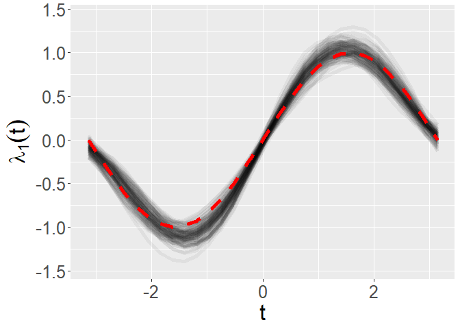
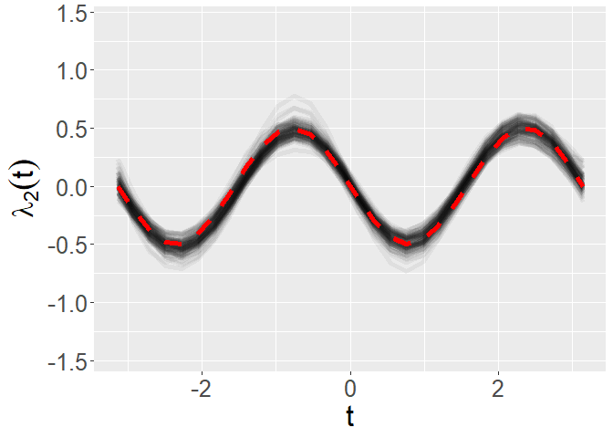
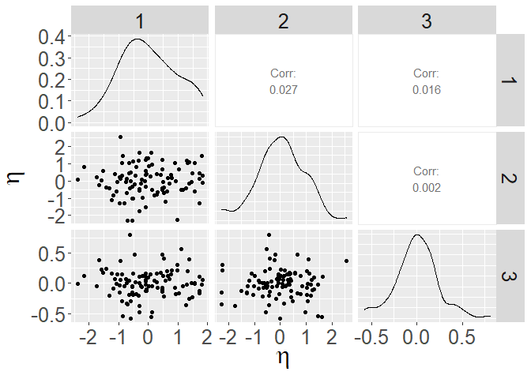
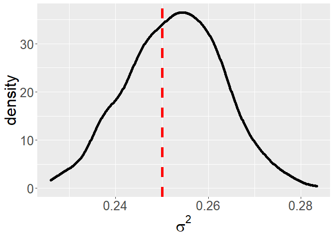
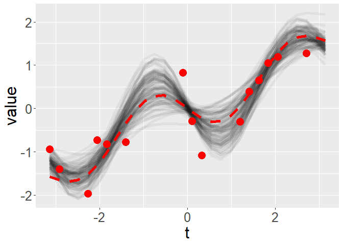
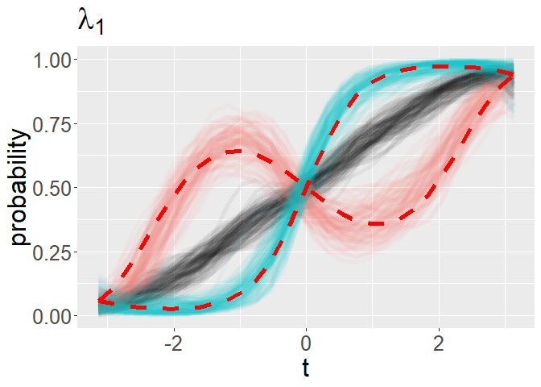
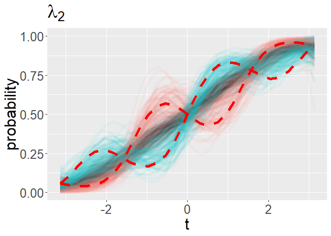
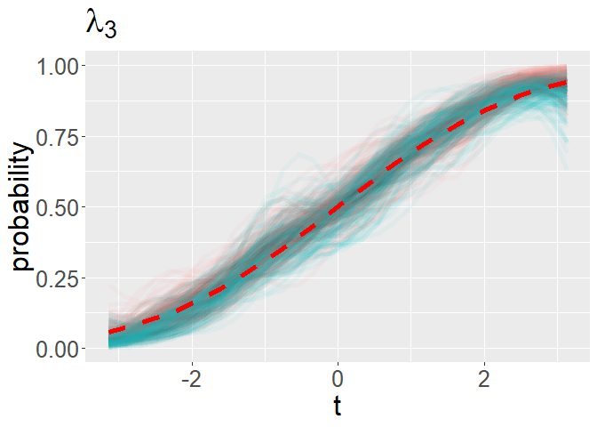
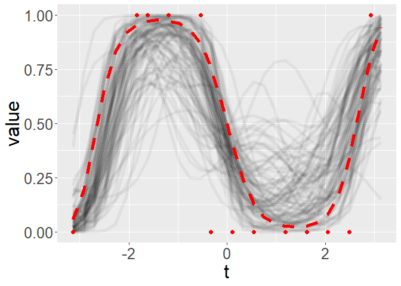

# Introduction 

This document demonstrates the methods described in the following paper: J. Matuk, A.H. Herring, D.B. Dunson (2022+) 'Bayesian Functional principal Components Analysis using Relaxed Mutually Orthogonal Processes'. The authors define relaxed mutually orthogonal (ReMO) processes, which are used to enforce near-mutual orthogonality for a set of random functions. As demonstrated in the paper, ReMO processes are useful as a prior model for inferring dominant modes of variability in functional principal components analysis (FPCA) and generalizations to non-Gaussian data. See the paper for an in depth discussion for the motivation and methods. This GitHub repository has code that implements the methods described in the paper. 

The directory  `paper_replication` has code that replicates the results presented in the paper. View the `README.txt` file for the workflow to replicate the paper results. 

The remainder of this document is dedicated to implementing simple examples on simulated data to help practitioners implement the methods for applications of interest. The following packages need to be loaded into the current `R` session: `Rcpp`, `tidyverse`, `reshape2`, `GGally`, `rootSolve`. The `src` directory contains `R` and `c++` functions that will be used throughout this demonstration, and should be included in the current `R` working directory. The functions used for FPCA using ReMO processes can be sourced as follows. 


```r
sourceCpp("./src/remo_fpca.cpp")
sourceCpp("./src/msf.cpp")
source("./src/remo_fpca.R")
```

The first example illustrates Bayesian FPCA using ReMO processes. The second example illustrates Bayesian generalized FPCA (GFPCA) using ReMO processes for binary functional data. We assume the reader is familiar with the 'Bayesian Functional principal Components Analysis using Relaxed Mutually Orthogonal Processes' paper from which we borrow notation. 

# FPCA using ReMO processes 

The follow code chunk generates noiseless random functions according the observation model in the paper (Equation (7)). That is, $f_i(t) = \mu(t) + \sum_{k = 1}^2\eta_{k,i}\lambda_k(t)$, where $\mu$ denotes the mean process, $\lambda_1,\lambda_2$ are orthogonal functions that represent FPCs, and $\eta_{1,i}\eta_{2,i}$ are FPC scores, $i = 1,\ldots,100$. The FPC scores are standard normal random variables that have been projected to sum to zero, so that the FPCs are not confounded with the mean process. The mean process and FPCs are evaluated on the same common time grid, `time_grid`.


```r
# set seed for reproducibility
set.seed(1234) 
# common observation grid of length M
M <- 30
time_grid <- seq(-pi,pi,length.out = M) 
# linear mean process with slope .5 and intercept 0
mu_true <- .5*time_grid
# FPCs are orthogonal functions 
lambda_true <- cbind(sin(time_grid),.5*sin(2*time_grid))
# true number of non-zero FPCs
K_true  <- dim(lambda_true)[2]
# number of simulated observations
N <- 100
# FPC scores
eta_true <- rnorm(K_true*N) %>% matrix(nrow = K_true)
eta_true <- eta_true - apply(eta_true,1,mean)%*%t(rep(1,N)) # ensure that they sum to zero
# underlying noiseless functions
f <- mu_true%*%t(rep(1,N)) + lambda_true%*%eta_true
```

We generate and visualize the observations $y_i$ that we will use to inform our model. These are sparse and noisy version of the underlying functions $f_i$.  


```r
#generate  subject specific observation grids
sparsity_level <- .5
obs_grid <- sample(c(0,1),M*N,replace = T, prob = c(sparsity_level,1-sparsity_level)) %>%
            matrix(nrow = M) 
# noise
noise_level <- .5
noise <- rnorm(M*N,sd = noise_level) %>% matrix(nrow = M)
# sparse and noisy observations
y <- f + noise
y_common <- y*obs_grid
plot_data(time_grid,y_common,obs_grid)
```

<!-- -->

Notice that `y_common` is an $M\times N$ matrix, `obs_grid` is an $M\times N$ binary matrix, and `time_grid` is an $M$ vector.

The Markov chain Monte Carlo (MCMC) algorithm presented in Appendix B of the paper (Algorithm 1) for FPCA using ReMO processes is implemented in the function `remo_fpca_mcmc`. Inputs include the observations, `y_common`, subject-specific grids, `obs_grid`, and  common grid `time_grid`. `K` is the assumed number of FPCs. Prior hyperparameters for length-scale and scale parameters of the covariance functions of parent GPs are specified using variables `prior_a`, `prior_b` and `prior_var`. The function `length_scale_hyper` is designed to specify appropriate hyperparameters for the length-scale parameter based on `time_grid`. The total number of MCMC iterations is specified as `n_iter`, and the number of of MCMC samples to save is specified based on `lag`. In total `n_iter/lag` MCMC iterations are saved.  Under these settings, the MCMC wrapper function,`remo_fpca_mcmc`, took around 1 minute to run on a standard laptop. 


```r
# specify parameters for MCMC
K <- 3
nu_eta <- 1e-4
nu_lambda <- 1e-4

inv_g_hyper <- length_scale_hyper(time_grid)
prior_a <- inv_g_hyper[1]
prior_b <- inv_g_hyper[2]
prior_var <- 1
n_iter <- 10000
lag <- 10
# run MCMC algorithm
mcmc_output <- remo_fpca_mcmc(y_common,obs_grid,time_grid,
                           K,nu_eta,nu_lambda,
                           prior_a,prior_b,prior_var,
                           n_iter,lag)
```

The `mcmc_output` variable is a list that contains MCMC samples for all parameters in the hierarchical models presented in Appendix D of the paper. The parameters $\lambda_1,\ldots,\lambda_3$ and $\eta_{1,i},\ldots,\eta_{3,i}$ are not identifiable due to label switching and sign ambiguities. These identifiability issues can be resolved using [E. Poworoznek, F. Ferrari, D.B. Dunson (2021) 'Efficiently resolving rotational ambiguity in Bayesian matrix sampling with matching'](https://arxiv.org/abs/2107.13783,) (Algorithm 1, steps 2-3). This ambiguity is resolved based on functions forked from the `infintiefactor` `R` package. MCMC samples with ambiguity resolved are stored in `mcmc_processed`.


```r
mcmc_processed <- organize_mcmc(mcmc_output,time_grid,n_iter/lag)
```

Inference is based on these processed posterior samples. The following code chunk visualizes the inferred mean process, $\mu$. The mean process used to generate the data in the following figure is shown using the dashed, red line and the MCMC samples are shown using transparent gray lines. 


```r
p <- plot_fun_parameter(mcmc_output$mu_save,time_grid,y_label = expression(mu(t)))
p + geom_line(aes(x = time_grid,y = mu_true),color = 'red',size = 2,linetype = 2)
```

<!-- -->

The following code chunk visualizes the inferred FPCs, $\lambda_1,\ldots,\lambda_3$. The FPCs used to generate the data in the following figure is shown using the dashed, red line and the MCMC samples are shown using transparent gray lines. 


```r
yl <- c(min(mcmc_processed$lambda_save),max(mcmc_processed$lambda_save))
p <- plot_fun_parameter(mcmc_processed$lambda_save[,1,],time_grid,y_label = expression(lambda[1](t)),yl = yl)
p + geom_line(aes(x = time_grid,y = lambda_true[,1]),color = 'red',size = 2,linetype = 2)
```

<!-- -->

```r
p <- plot_fun_parameter(mcmc_processed$lambda_save[,2,],time_grid,y_label = expression(lambda[2](t)),yl = yl)
p + geom_line(aes(x = time_grid,y = -lambda_true[,2]),color = 'red',size = 2,linetype = 2)
```

<!-- -->

```r
p <- plot_fun_parameter(mcmc_processed$lambda_save[,3,],time_grid,y_label = expression(lambda[3](t)),yl = yl)
p + geom_line(aes(x = time_grid,y = rep(0,M)),color = 'red',size = 2,linetype = 2)
```

<!-- -->

The following code chunk visualizes posterior means of FPC scores, $\eta_{1,i},\ldots,\eta_{3,i},\ i = 1,\ldots,100$. 


```r
eta_mean <- apply(mcmc_processed$eta_save[,,(.5*n_iter/lag):(n_iter/lag)],c(1,2),mean)
eta_mean_df <- as.data.frame(t(eta_mean))
colnames(eta_mean_df) <- 1:dim(eta_mean_df)[2]
ggpairs(eta_mean_df) + 
  xlab(expression(eta)) + ylab(expression(eta)) + theme(text = element_text(size = 24)) 
```

<!-- -->

The following code chunk visualizes the posterior samples of error variance, $\sigma^2$, with the error variance used to generate the data shown using a dashed, red line. 


```r
ggplot() + geom_density(aes(x = mcmc_output$sig_sq_save[(.5*n_iter/lag):(n_iter/lag)]),size = 2) + 
  geom_vline(aes(xintercept = noise_level^2),color = 'red',linetype = 2,size = 2) + 
  xlab(expression(sigma^2)) + theme(text = element_text(size = 24)) 
```

<!-- -->


For a randomly selected observation $i$, the following code chunk visualizes posterior samples of the inferred underlying, $f_i$, as transparent gray lines compared to sparse and noisy observations $y_i$, shown as red points, and the underlying function used to generate the data, shown as a dashed, red line.


```r
rand_obs <- sample(N,1)
fit_samples <- compute_fit_samples(mcmc_processed)
p <- plot_fun_parameter(fit_samples[,rand_obs,],time_grid)
p + geom_point(aes(x = time_grid[obs_grid[,rand_obs] == 1],y = y_common[obs_grid[,rand_obs] == 1,rand_obs]),color = 'red',size = 5) +
  geom_line(aes(x = time_grid,y = f[,rand_obs]),color = 'red',linetype = 2,size = 2)
```

<!-- -->


# Binary FPCA using ReMO processes 

We generate binary functional observations according to Equation (10) in the paper. First, $f_i(t) = \mu(t) + \sum_{k = 1}^2\eta_{k,i}\lambda_k(t)$ are generated in the exact same way as the previous section. Then, binary observations are generated based on a probit model, $z_i(t) = 1) = \Phi(f_i(t))$, where $\Phi(\cdot)$ is the standard normal cumulative distribution function. Simulated observations are visualized in the following code chunk. 


```r
# for reproducibility
set.seed(1234) 
# common observation grid of length M
M <- 30
time_grid <- seq(-pi,pi,length.out = M) 
# linear mean process with slope .5 and intercept 0
mu_true <- .5*time_grid
# FPCs are orthogonal functions 
lambda_true <- cbind(sin(time_grid),.5*sin(2*time_grid))
# true number of non-zero FPCs
K_true  <- dim(lambda_true)[2]
# number of simulated observations
N <- 100
# FPC scores
eta_true <- rnorm(K_true*N) %>% matrix(nrow = K_true)
eta_true <- eta_true - apply(eta_true,1,mean)%*%t(rep(1,N))
# underlying noiseless latent functions
f <- mu_true%*%t(rep(1,N)) + lambda_true%*%eta_true
```


```r
# subject specific observation grids
sparsity_level <- .5
obs_grid <- sample(c(0,1),M*N,replace = T, prob = c(sparsity_level,1-sparsity_level)) %>%
  matrix(nrow = M) 
# sparse and noisy observations
z <- as.numeric(matrix(runif(M*N),nrow = M)<pnorm(f)) %>%
  matrix(nrow = M)
z_common <- z*obs_grid
# plot binary functional data
plot_data(time_grid,z_common,obs_grid)
```

<!-- -->

The Markov chain Monte Carlo (MCMC) algorithm presented in Appendix B of the paper (Algorithm 2) for GFPCA using ReMO processes is implemented in the function `remo_binary_fpca_mcmc`. All of the arguments are the same as the `remo_fpca_mcmc` function, except for the first argument, which is assumed to be a binary matrix rather than  a matrix of real numbers. Under the specified settings, the MCMC wrapper function,`remo_binary_fpca_mcmc`, took around 2 minutes to run on a standard laptop. Notice that there still is potential ambiguity in the MCMC samples that is resolved using the `organize_mcmc` function.


```r
# specify parameters for MCMC
K <- 3
nu_eta <- 1e-4
nu_lambda <- 1e-4
inv_g_hyper <- length_scale_hyper(time_grid)
prior_a <- inv_g_hyper[1]
prior_b <- inv_g_hyper[2]
prior_var <- 1
n_iter <- 10000
lag <- 10
# run MCMC algorithm 
mcmc_output <- remo_binary_fpca_mcmc(z_common,obs_grid,time_grid,
                              K,nu_eta,nu_lambda,
                              prior_a,prior_b,prior_var,
                              n_iter,lag)
# process MCMC samples
mcmc_processed <- organize_mcmc(mcmc_output,time_grid,.5*n_iter/lag)
```

Inference is based on the processed posterior samples. The following code chunk visualizes the generalized FPCs, by showing the inferred mean function (transparent gray lines), plus/minus 1 standard deviation in the direction of the inferred FPC (transparent red/blue lines) interpreted through the probit link function. The mean used to generated the data plus/minus 1 standard deviation in the direction of the FPCs used to generate the data are shown with dashed, red lines.


```r
# visualize FPCs 
k <- 1
p <- plot_binary_fpcs(mcmc_processed,time_grid,k,title_label = expression(lambda[1])) 
p + geom_line(aes(x = time_grid,y = pnorm(mu_true + sd(eta_true[k,])*lambda_true[,k])),color = 'red',size = 2,linetype = 2) +
  geom_line(aes(x = time_grid,y = pnorm(mu_true - sd(eta_true[k,])*lambda_true[,k])),color = 'red',size = 2,linetype = 2)
```

<!-- -->

```r
k <- 2
p <- plot_binary_fpcs(mcmc_processed,time_grid,k,title_label = expression(lambda[2])) 
p + geom_line(aes(x = time_grid,y = pnorm(mu_true + sd(eta_true[k,])*lambda_true[,k])),color = 'red',size = 2,linetype = 2) +
  geom_line(aes(x = time_grid,y = pnorm(mu_true - sd(eta_true[k,])*lambda_true[,k])),color = 'red',size = 2,linetype = 2)
```

<!-- -->

```r
k <- 3
p <- plot_binary_fpcs(mcmc_processed,time_grid,k,title_label = expression(lambda[3])) 
p + geom_line(aes(x = time_grid,y = pnorm(mu_true)),color = 'red',size = 2,linetype = 2) +
  geom_line(aes(x = time_grid,y = pnorm(mu_true)),color = 'red',size = 2,linetype = 2)
```

<!-- -->

For a randomly selected observation $i$, the following code chunk visualizes posterior samples of the inferred underlying, $\Phi(f_i)$, as transparent gray lines compared to sparse and noisy observations $z_i$, shown as red points, and the underlying function used to generate the data, shown as a dashed, red line.


```r
fit_samples <- pnorm(compute_fit_samples(mcmc_processed))
rand_obs <- sample(N,1)
p <- plot_fun_parameter(fit_samples[,rand_obs,],time_grid,y_label = "value",yl = c(0,1)) 
p + geom_point(aes(x = time_grid[obs_grid[,rand_obs] == 1],y = z_common[obs_grid[,rand_obs] == 1,rand_obs]),color = 'red',size = 2) +
  geom_line(aes(x = time_grid,y = pnorm(f[,rand_obs])),color = 'red',linetype = 2,size = 2)
```

<!-- -->

# Discussion 

This document has illustrates simple examples of FPCA and GFPCA using ReMO processes with code that is available in this repository. When implementing the code in different application settings it is crucial to ensure that the MCMC algorithm has converged, see for example [Gelman et al. (2013) 'Bayesian Data Analysis'](http://www.stat.columbia.edu/~gelman/book/BDA3.pdf), chapter 11.4 as an example reference that discusses MCMC diagnosing convergence. The parameter $\nu_\lambda$, which controls the degree to which ReMO processes are nearly mutual orthogonal, is fixed to `1e-4`. In different applications, it may be necessary to alter this value. See the 'Bayesian Functional principal Components Analysis using Relaxed Mutually Orthogonal Processes' paper for a discussion on this hyperparameter value. 

